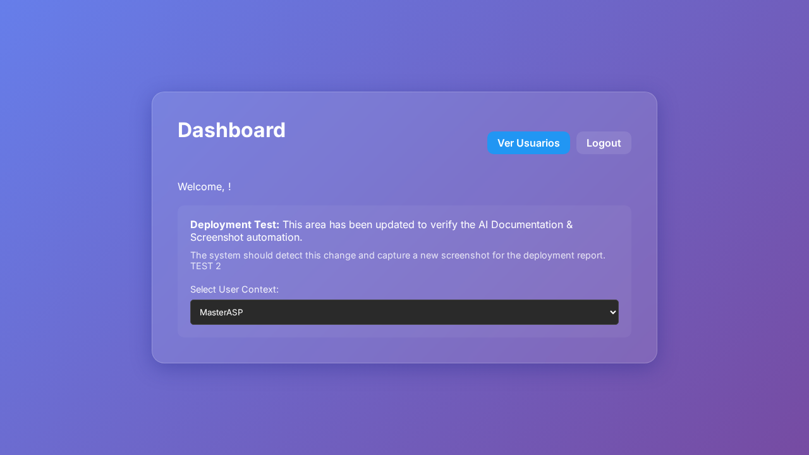
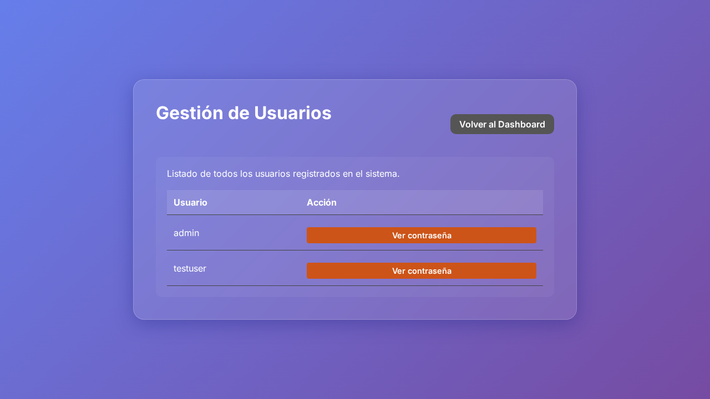

```markdown
# Documento Técnico - Deploy

1. **Resumen Ejecutivo**
   Se ha implementado una nueva funcionalidad en el sistema que permite listar usuarios y visualizar sus contraseñas. Para ello, se ha añadido una nueva ruta `/users` y un botón en el dashboard que abre un popup mostrando la contraseña del usuario seleccionado. Los cambios principales se encontraron en el archivo `scripts/capture-screens.js`, donde se añadió lógica para identificar y ejecutar acciones vinculadas al issue.

2. **Cambios Backend (express)**
   No se han detectado cambios dentro del servidor `express` (como en `server.js`) que afecten a la lógica del backend o al manejo directo de rutas desde el servidor.

3. **Cambios Frontend (carpeta /public)**
   No se realizaron cambios directos a los archivos HTML o CSS dentro de la carpeta `/public` que se mencionen específicamente en el diff proporcionado. Sin embargo, se alude a cambios en la lógica de captura de rutas y acciones a nivel de cliente en `scripts/capture-screens.js`.

4. **Impacto Técnico**
   Los cambios permiten mostrar un popup en el frontend que revela las contraseñas de los usuarios al hacer click en el botón "ver contraseña". No se han hecho cambios directos al sistema de archivos front-end, pero los scripts ayudan a identificar rutas y acciones requeridas para los tests visuales automáticos.

5. **Riesgos**
   - Seguridad: Mostrar contraseñas de usuarios puede presentar un riesgo considerable si no se maneja adecuadamente.
   - Visualización: Dependiendo del método de despliegue, puede que los popups no se rendericen correctamente si hay problemas con JavaScript o la carga de archivos.
   - Automatización: Errores en la lógica de detección automatizada pueden no capturar correctamente la necesidad de pruebas visuales.

6. **Consideraciones de Deploy**
   - Asegurarse de que las herramientas de automatización y prueba (como Playwright) estén correctamente configuradas en el entorno de despliegue.
   - Revisar configuraciones de seguridad relacionadas a la exposición de datos confidenciales como las contraseñas.

7. **Evidencia Visual**
   

### Ruta: /dashboard


### Ruta: /users


### Ruta: /


8. **Fragmentos de Código**

   Se realizaron varias modificaciones en `scripts/capture-screens.js` para manejar el contexto del issue y ajustar las rutas:

   ```diff
   +async function getIssueContext() {
   +    ...
   +    const commitMatch = commitMsg.match(/#(\d+)/);
   +    ...
   +    const issueData = execSync(`gh issue view ${issueId} --json title,body`).toString();
   +    const { title, body } = JSON.parse(issueData);
   +    return `Goal/Context: ${title} - ${body}`;
   +    ...
   +}
   ```

   La función `getIssueContext` fue añadida para extraer información del issue relacionado y proporcionar contexto adicional para la detección automatizada de rutas y acciones.

   ```diff
   -async function captureScreenshots(routes, diff) {
   +async function captureScreenshots(routes, diff, issueContext) {
   ...
   +                    Contexto del Objetivo:
   +                    ${issueContext}
   ```

   Se ha modificado la función `captureScreenshots` para tomar en consideración el contexto del issue al momento de capturar las acciones necesarias para la visualización de cambios.
```
