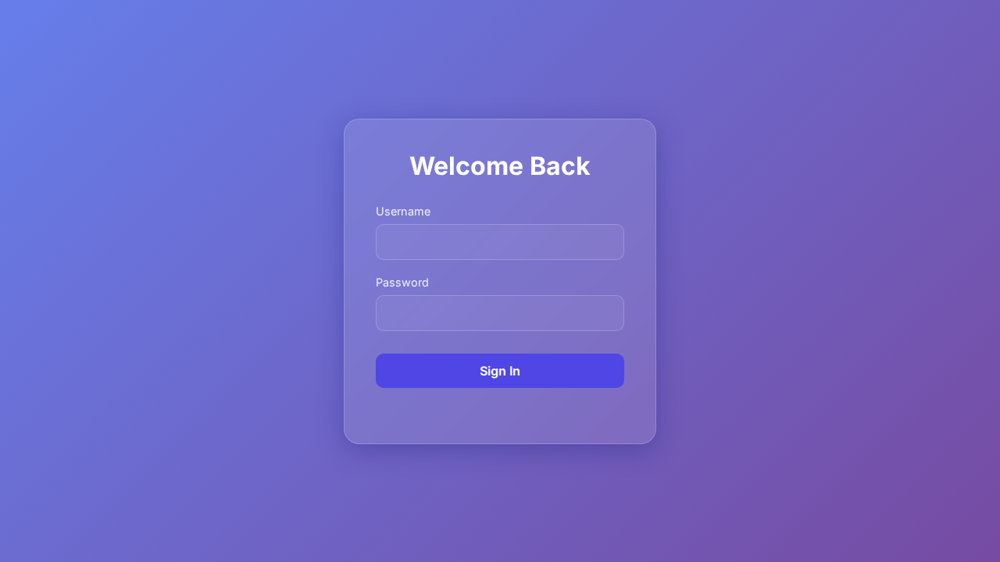

```markdown
# Documento Técnico - Deploy

1. Resumen Ejecutivo
   El objetivo de este cambio es implementar una nueva funcionalidad en el sistema que permita a los usuarios del dashboard acceder a una lista de usuarios junto con un botón para visualizar sus contraseñas. Este cambio implica la creación de una nueva ruta `/users` y la adición de un botón "ver contraseña" que despliega un popup para mostrar la contraseña del usuario seleccionados. El código modificado se centra en asegurarse de que los elementos visuales y los botones interactivos estén completamente cargados antes de capturar capturas de pantalla.

2. Cambios Backend (express)
   No se realizaron cambios directos en el lado del servidor (backend) dentro de los archivos relevantes como `server.js` o cualquier lógica de servidor que maneje peticiones o rutas de Express.

3. Cambios Frontend (carpeta /public)
   La modificación se encuentra en el script de prueba `scripts/capture-screens.js`, el cual forma parte del proceso de testing automatizado para capturar capturas de pantalla de las rutas del sistema. No hay cambios directos en los archivos HTML, CSS o JavaScript que correspondan directamente a la interfaz de usuario que reside típicamente en la carpeta `/public`.

4. Impacto Técnico
   - La captura de pantallas ahora incluye un manejo específico para la ruta `/users` asegurando que los botones estén completamente cargados antes de proceder, lo que probablemente evita la toma de capturas de pantalla incompletas o erróneas.
   - Mejora la robustez del proceso de testing automatizado al proporcionar mensajes de depuración si los elementos no se cargan como se espera.

5. Riesgos
   - Si los botones ".btn-view" no se cargan correctamente o si su clase cambia sin actualizar este script, es posible que las capturas de pantalla no se tomen correctamente, lo cual podría afectar la validación visual de la interfaz de usuario relativa al listado de usuarios.
   - Otro riesgo inherentemente no abordado en los cambios realizados podría ser la exposición de contraseñas si no se implementan adecuadamente medidas de seguridad en el manejo de las mismas.

6. Consideraciones de Deploy
   - Es necesario asegurarse de que cualquier componente dependiente, como el sistema de autenticación o manejo de permisos, esté configurado correctamente para evitar la exposición no autorizada de las contraseñas.
   - Verificar que el entorno de despliegue disponga de la capacidad de ejecutar scripts de captura de pantallas correctamente con las librerías necesarias instaladas.

7. Evidencia Visual
   

### Ruta: /dashboard


### Ruta: /index


### Ruta: /users


8. Fragmentos de Código
   ```diff
   diff --git a/scripts/capture-screens.js b/scripts/capture-screens.js
   index 80a2ec7..9344988 100644
   --- a/scripts/capture-screens.js
   +++ b/scripts/capture-screens.js
   @@ -158,6 +158,12 @@ async function captureScreenshots(routes, diff, issueContext) {
               // Pequeña espera extra para asegurar renderizado de animaciones o carga de datos
               await page.waitForTimeout(1000);
   
   +            // Si es la página de usuarios, esperamos específicamente a que carguen los botones dinámicos
   +            if (route.includes('users')) {
   +                console.log('Esperando carga de tabla de usuarios...');
   +                await page.waitForSelector('.btn-view', { timeout: 5000 }).catch(() => console.log('No se encontraron botones .btn-view tras esperar'));
   +            }
   +
               await page.screenshot({ path: filePath, fullPage: true });
   
               capturedImages.push({
   @@ -198,12 +204,20 @@ async function captureScreenshots(routes, diff, issueContext) {
   
                       Basado en el diff Y el contexto del Objetivo (Issue), ¿hay algún elemento con el que se deba interactuar para revelar visualmente la funcionalidad (ej: abrir modales, cambiar selects)?
                       
   -                    Contexto del Objetivo:
   -                    ${issueContext}
   -
   -                    Cambio en el código (Diff):
   +                    RESUMEN DE CAMBIOS EN ESTE COMMIT:
                       ${diff.substring(0, 2000)}
   
   +                    RUTA ACTUAL: ${route}
   +                    CONTEXTO GLOBAL DE LA TAREA:
   +                    ${issueContext}
   +
   +                    Responde únicamente con un JSON válido con este formato:
   +                    {
   +                      "actions": [
   +                        { "targetId": "ai-elem-X", "action": "click" }
   +                      ]
   +                    }
   +                    Si no hay acciones relevantes, devuelve "actions": [].
                       ```

```
