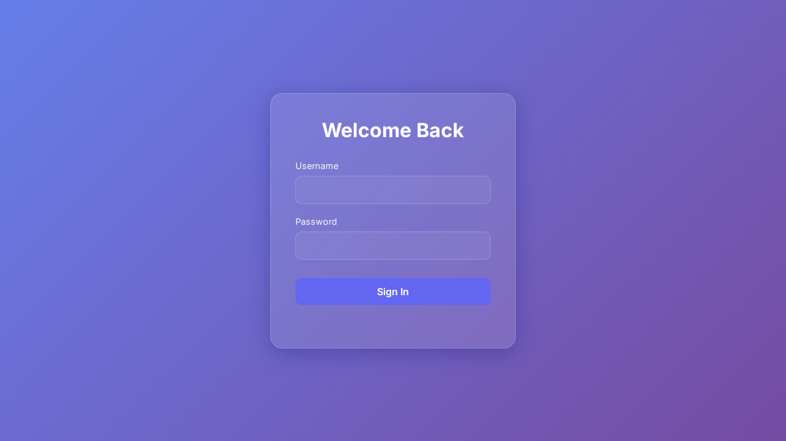
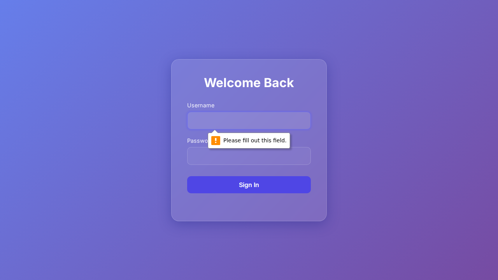

```markdown
# Documento Técnico - Deploy

1. **Resumen Ejecutivo**
   El objetivo principal del Issue #2 es añadir una funcionalidad que permita listar los usuarios del sistema y visualizar sus contraseñas. Para lograr esto se ha creado una nueva ruta `/users` y se ha añadido un botón en el dashboard que permite acceder a la lista de usuarios. Las contraseñas están inicialmente ocultas y se despliegan en un popup al pulsar un botón "ver contraseña".

2. **Cambios Backend (express)**
   No se observaron cambios específicos en el backend, o en la lógica del servidor (archivo `server.js`). Los cambios parecen estar centrados en la lógica de frontend y la interacción del usuario.

3. **Cambios Frontend (carpeta /public)**
   Los cambios se realizaron principalmente en el archivo `scripts/capture-screens.js`, donde se añadieron modificaciones para capturar automáticamente pantallas relacionadas con la funcionalidad añadida:
   - Ajustes en la lógica para determinar qué rutas capturarán pantallas basándose en el objetivo relacionado con el issue.
   - Mejora en el prompt de IA para priorizar interacciones que revelan la funcionalidad de ver contraseñas.
   - Registración de acciones de IA y toma de capturas de pantalla tras la interacción.

4. **Impacto Técnico**
   La implementación proporciona un mecanismo automatizado para verificar visualmente las funcionalidades de visualización de contraseñas para los usuarios listados. Esto puede facilitar el aseguramiento de calidad al permitir capturas de pantalla automáticas que validan el comportamiento esperado.

5. **Riesgos**
   - Si hay cambios posteriores en la estructura del HTML o en los identificadores de los elementos interactivos (como botones), el script de captura de pantalla puede fallar al no encontrar los elementos esperados.
   - La exposición de las contraseñas, incluso temporalmente, puede presentar un riesgo de seguridad si no se controla adecuadamente el acceso a este sistema.

6. **Consideraciones de Deploy**
   Es importante asegurar que el servidor de Express esté configurado correctamente para servir los archivos de la carpeta `/public` y que las rutas necesarias, especialmente `/users`, están disponibles y funcionales en el entorno de producción.

7. **Evidencia Visual**
   - 

### Ruta: /dashboard


### Ruta: /dashboard


### Ruta: /index


### Ruta: /index


### Ruta: /users


### Ruta: /users


: Capturas de pantalla tomadas durante la interacción, como mostrar contraseñas en el listado de usuarios, para verificar visualmente la implementación de la funcionalidad.

8. **Fragmentos de Código**

   Aquí se presenta un resumen de los cambios realizados en `scripts/capture-screens.js`:

   ```diff
   @@ -72,11 +72,13 @@ async function getAutomatedRoutes(changedFiles, issueContext) {
   -    Tu tarea es determinar qué rutas de la aplicación deben ser capturadas para mostrar los cambios. 
   +    Tu tarea es determinar qué rutas de la aplicación deben ser capturadas para EXPLICAR al cliente los cambios relacionados con el OBJETIVO (Issue). 
   +    
   +    TEN EN CUENTA QUE:
   +    1. El objetivo principal actual es: "${issueContext}".
   ...
   -                    Basado en el diff Y el contexto del Objetivo (Issue), ¿hay algún elemento con el que se deba interactuar para revelar visualmente la funcionalidad (ej: abrir modales, cambiar selects)?
   +                    Basado en el OBJETIVO de la tarea y el estado actual de la pantalla, ¿qué acciones deberíamos realizar para MOSTRAR la funcionalidad al usuario (ej: hacer click en un botón de "Ver contraseña", abrir un modal, etc.)?
   ...
   +                    INSTRUCCIÓN: Prioriza el OBJETIVO. Si el objetivo es mostrar contraseñas y ves un botón que dice "Ver contraseña", DEBES clicarlo.
   ...
   +                            console.log(`[AI DECISION]: ${action.reason}`);
   +                            console.log(`Ejecutando: ${action.action} sobre ${action.targetId}`);
   ```

Este documento proporciona un desglose detallado de los cambios y las implicaciones técnicas de la implementación solicitada en el Issue #2.
```