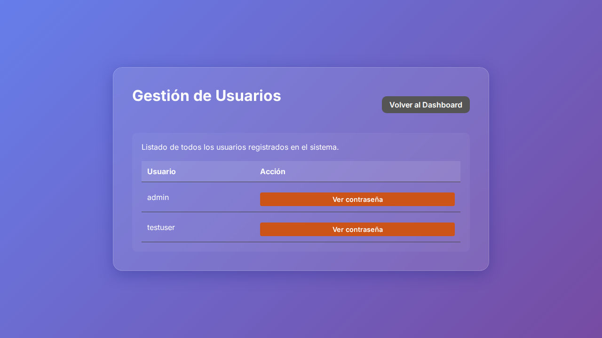
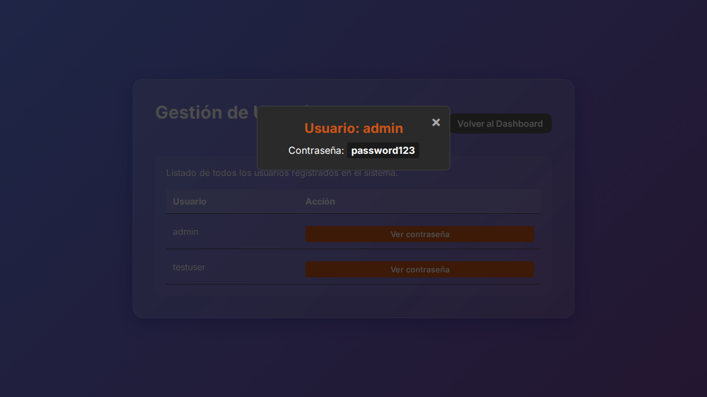

# Documento Técnico - Deploy

1. **Resumen Ejecutivo**
   En el contexto del issue relacionado con la redirección posterior al cierre de sesión, se ha realizado una corrección en el archivo de pruebas `login.spec.js`. El cambio aborda la validación de la URL a la que se redirige al usuario tras cerrar sesión, actualizando la expresión regular utilizada para la validación de la URL de destino correcta.

2. **Cambios Backend (express)**
   No se han identificado cambios en el lado del servidor, incluyendo el archivo `server.js`. Todos los cambios se centran en el ámbito de las pruebas front-end.

3. **Cambios Frontend (carpeta /public)**
   No hay cambios directos en los archivos HTML, JavaScript o CSS dentro de la carpeta `/public`. Los cambios se limitan a la prueba del flujo de autentificación en el archivo `login.spec.js`.

4. **Impacto Técnico**
   La actualización en el test asegura que la comprobación de la redirección tras el cierre de sesión se realiza de manera más precisa utilizando una expresión regular que valida correctamente el formato de la URL local esperada. Este cambio garantiza que las pruebas reflejen con mayor precisión el comportamiento deseado en entornos de desarrollo locales.

5. **Riesgos**
   - **Falsos Positivos/Negativos en Pruebas:** Si la estructura de la URL se modifica nuevamente, puede ser necesario ajustar la prueba para asegurar su validez continua.

6. **Consideraciones de Deploy**
   - Verificar que el entorno de pruebas local donde se ejecutan estos tests está adecuadamente configurado para que `http://localhost:<puerto>/` sea el punto base del recurso esperado tras cerrar sesión.
   - Actualizar la documentación de pruebas para reflejar estos cambios y el contexto bajo el cual fueron necesarios.

7. **Evidencia Visual**
   - 

### Ruta: /dashboard


### Ruta: /dashboard


### Ruta: /users


### Ruta: /users


### Ruta: /


8. **Fragmentos de Código**

```diff
diff --git a/tests/login.spec.js b/tests/login.spec.js
index bd6ec3f..54b18b4 100644
--- a/tests/login.spec.js
+++ b/tests/login.spec.js
@@ -42,6 +42,6 @@ test.describe('Login Flow', () => {
         await page.click('#logoutBtn');
 
         // Should redirect back to login
-        await expect(page).toHaveURL(/.*index.html/);
+        await expect(page).toHaveURL(/^http:\/\/localhost:\d+\/$/);
     });
 });
```

Este bloque de código muestra la modificación en la validación de la URL de redirección tras el logout, cambiando la verificación de la URL esperada.