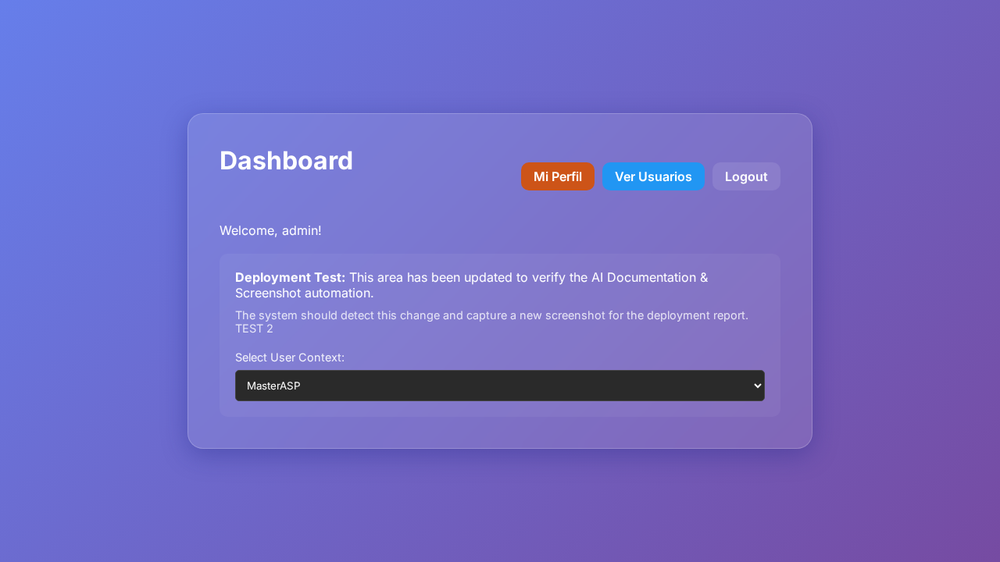
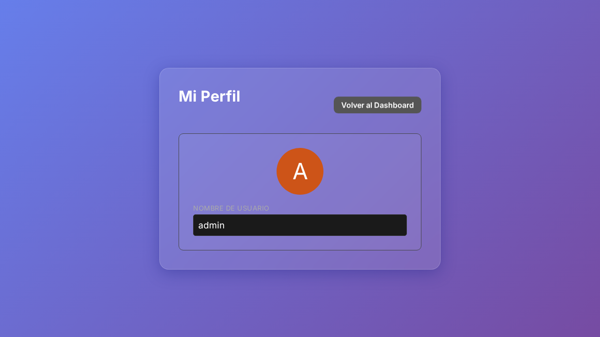
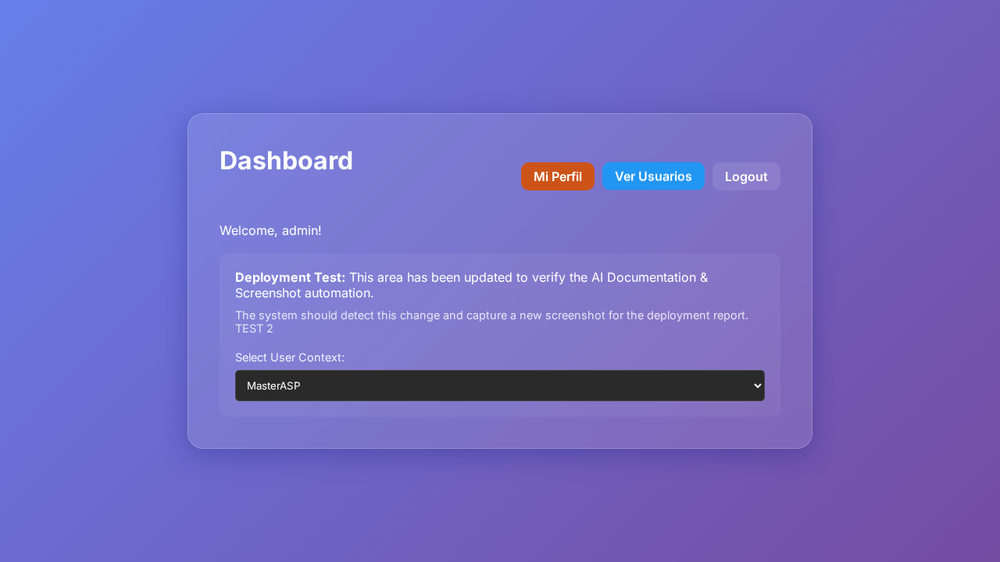

```markdown
# Documento Técnico - Deploy

1. **Resumen Ejecutivo**
   Este documento detalla los cambios realizados para implementar una nueva funcionalidad de perfil de usuario en una aplicación web. Se han modificado tanto el frontend como el backend para permitir que los usuarios visualicen y actualicen su información de perfil desde un panel de usuario. Este cambio fue impulsado por la necesidad de mejorar la experiencia del usuario al proporcionarles una sección dedicada para su perfil.

2. **Cambios Backend (express)**
   Se han introducido nuevos endpoints en el archivo `server.js` para manejar las solicitudes relacionadas con el perfil del usuario:
   - Se añadió un endpoint `GET /api/profile` que responde con los datos del perfil del usuario autenticado, excluyendo la contraseña.

   ```diff
   +app.get('/api/profile', (req, res) => {
   +    if (req.session.loggedIn) {
   +        const users = getUsers();
   +        const user = users.find(u => u.username === req.session.username);
   +        if (user) {
   +            const { password, ...userProfile } = user;
   +            res.json(userProfile);
   +        } else {
   +            res.status(404).json({ error: 'User not found' });
   +        }
   +    } else {
   +        res.status(401).json({ error: 'Unauthorized' });
   +    }
   +});
   ```

3. **Cambios Frontend (carpeta /public)**
   Múltiples archivos HTML y JavaScript han sido modificados o creados para añadir la funcionalidad de perfil:

   - `dashboard.html`: Se añadió un botón que redirige a la página de perfil del usuario.
   - `profile.html` (nuevo): Se creó una nueva página que muestra los datos del perfil del usuario.
   - `profile.js` (nuevo): Archivo script que maneja la lógica de carga de datos del perfil una vez que la página está lista.

   ```diff
   +<button class="logout-btn" style="background-color: #cd5418; border-color: #cd5418;"
   +    onclick="window.location.href='/profile'">Mi Perfil</button>
   ```

   ```diff
   +document.addEventListener('DOMContentLoaded', async () => {
   +    try {
   +        const sessionRes = await fetch('/api/check-session');
   +        const sessionData = await sessionRes.json();
   +        if (!sessionData.loggedIn) {
   +            window.location.href = '/';
   +            return;
   +        }
   +    } catch (err) {
   +        console.error('Error verificando sesión:', err);
   +        window.location.href = '/';
   +        return;
   +    }
   +    loadProfile();
   +});
   ```

4. **Impacto Técnico**
   Estos cambios aumentan la funcionalidad del sistema al permitir a los usuarios visualizar datos de su perfil. La correcta gestión de estado de sesión asegura que solo los usuarios autenticados accedan a esta información. El flujo de acceso a perfil es ahora un componente clave de la experiencia de usuario.

5. **Riesgos**
   - Posibles problemas si la verificación de sesión falla, resultando en accesos no autorizados.
   - Errores en la carga de perfil podrían impactar la presentación de información incorrecta al usuario.
   - Los cambios en el lado del servidor podrían generar problemas de seguridad si no se valida apropiadamente cada solicitud.

6. **Consideraciones de Deploy**
   - Asegurarse de que el servidor esté configurado para manejar sesiones de forma segura.
   - Realizar pruebas exhaustivas en un entorno de staging antes del despliegue.
   - Verificar que todos los endpoints sean inaccesibles sin sesión autorizada.
   
7. **Evidencia Visual**
   

### Ruta: /dashboard


### Ruta: /dashboard


### Ruta: /profile


### Ruta: /profile



8. **Fragmentos de Código**

   **dashboard.html**
   ```diff
   +<button class="logout-btn" style="background-color: #cd5418; border-color: #cd5418;"
   +    onclick="window.location.href='/profile'">Mi Perfil</button>
   ```

   **profile.js**
   ```diff
   +document.addEventListener('DOMContentLoaded', async () => {
   +    try {
   +        const sessionRes = await fetch('/api/check-session');
   +        if (!sessionData.loggedIn) {
   +            window.location.href = '/';
   +            return;
   +        }
   +    } catch (err) {
   +        console.error('Error verificando sesión:', err);
   +        window.location.href = '/';
   +        return;
   +    }
   +    loadProfile();
   +});
   ```

   **server.js**
   ```diff
   +app.get('/api/profile', (req, res) => {
   +    if (req.session.loggedIn) {
   +        const users = getUsers();
   +        const user = users.find(u => u.username === req.session.username);
   +        if (user) {
   +            const { password, ...userProfile } = user;
   +            res.json(userProfile);
   +        } else {
   +            res.status(404).json({ error: 'User not found' });
   +        }
   +    } else {
   +        res.status(401).json({ error: 'Unauthorized' });
   +    }
   +});
   ```

```
