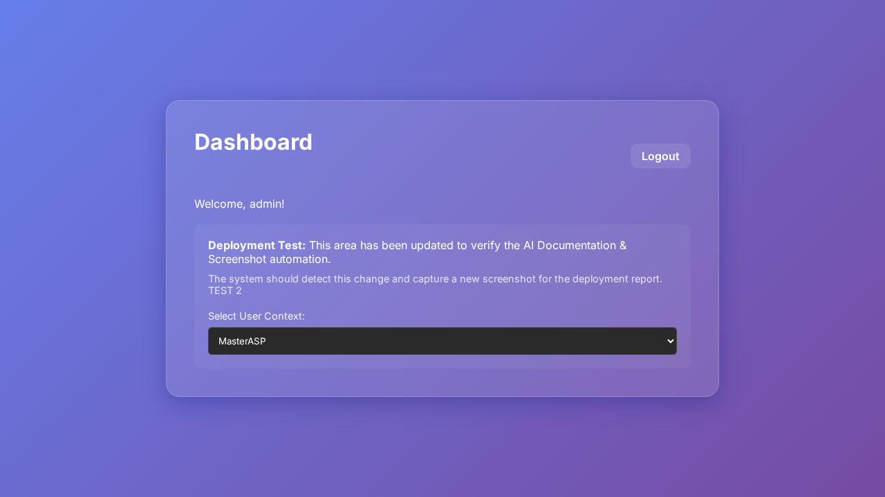
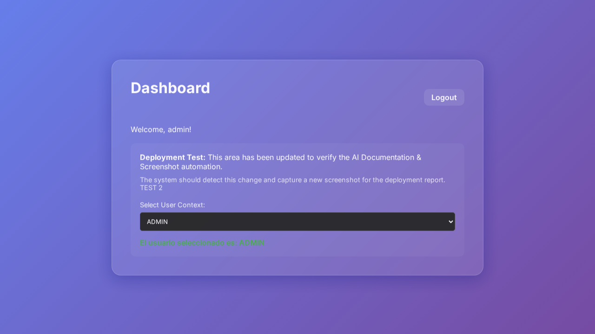
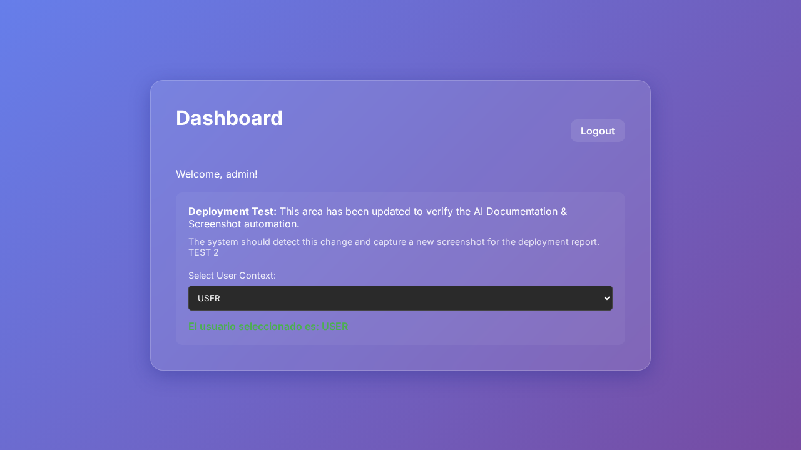

# Documento Técnico - Deploy

1. **Resumen Ejecutivo**
   Se ha implementado una nueva funcionalidad en el dashboard que permite a los usuarios seleccionar un perfil desde un menú desplegable. Al seleccionar un usuario, se muestra un mensaje indicando el usuario elegido. Esta funcionalidad ha sido desarrollada para mejorar la experiencia del usuario al interactuar con diferentes contextos de usuario en la aplicación.

2. **Cambios Backend (express)**
   No se detectaron cambios en el backend, específicamente en `server.js` o en la lógica de servidor.

3. **Cambios Frontend (carpeta /public)**
   - **app.js**: Se añadió la lógica para manejar el evento `change` en el elemento `select` del dashboard. Esta lógica actualiza el texto del elemento HTML correspondiente para mostrar el usuario seleccionado.
   - **dashboard.html**: Se añadió un `select` para el usuario en el dashboard, con opciones predefinidas como "MasterASP", "ADMIN", y "USER". También se adicionó un parágrafo para mostrar dinámicamente el usuario seleccionado.
   
4. **Impacto Técnico**
   La adición del selector de usuario en el dashboard permite a los usuarios seleccionar y visualizar diferentes perfiles de usuario, mejorando así la interacción y experiencia dentro de la aplicación. Esto no afecta otros aspectos del sistema, ya que los cambios son locales al frontend del dashboard.

5. **Riesgos**
   - Problemas potenciales de UI/UX si los estilos CSS no están completamente adaptados para varios navegadores.
   - La falta de validación de los datos introducidos podría resultar en errores si los valores no coinciden con los esperados.

6. **Consideraciones de Deploy**
   - No se requiere ninguna configuración adicional para desplegar esta funcionalidad, ya que todos los cambios son locales en el frontend.
   - Asegurarse de que el entorno de producción tenga correctamente configurados los permisos para el uso del GITHUB_TOKEN, ya que se añadió la lectura de issues.

7. **Evidencia Visual**
   

### Ruta: /index.html

### Ruta: /dashboard.html

### Ruta: /dashboard.html

### Ruta: /dashboard.html

8. **Comentarios específicos al issue**
   Los cambios están directamente relacionados con la issue de agregar un selector de usuarios en el dashboard. La solución implementa tanto la adición visual requerida como el mensaje confirmatorio de selección, cubriendo completamente los requisitos señalados en el issue original.