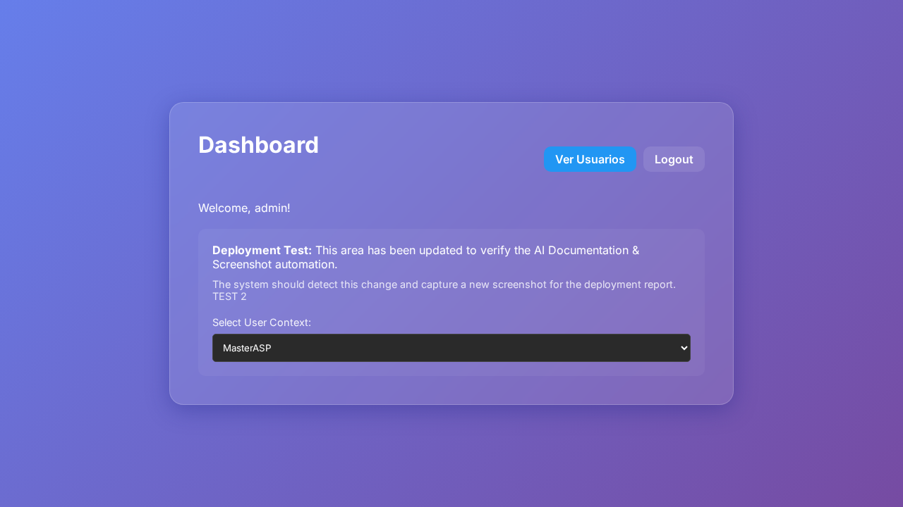

```markdown
# Documento Técnico - Deploy

1. **Resumen Ejecutivo**
   El objetivo principal del Issue #2 es introducir una funcionalidad que permita listar los usuarios del sistema y visualizar sus contraseñas. Para ello, se creó una nueva ruta `/users` y se añadió un botón en el dashboard que permite acceder a esta lista. Las contraseñas se mantienen inicialmente ocultas y se despliegan en un popup al pulsar un botón "ver contraseña".

2. **Cambios Backend (express)**
   No se identificaron cambios específicos en el backend o en la lógica del servidor (`server.js`). Los cambios fueron mayormente implementados en la lógica del frontend y la interacción del usuario.

3. **Cambios Frontend (carpeta /public)**
   Las modificaciones principales se realizaron en el archivo `scripts/capture-screens.js`. Se añadieron lógicas para capturar pantallas de forma automatizada como parte de la evidencia visual para verificar la nueva funcionalidad:
   - Ajustes en el script para desencadenar capturas de pantalla automatizadas basadas en la navegación y las interacciones del usuario.
   - Optimización del prompt de IA para enfocarse en interacciones críticas como el botón "ver contraseña".
   
4. **Impacto Técnico**
   La implementación de capturas automatizadas proporciona una herramienta para verificar visualmente las funcionalidades de visualización de contraseñas para los usuarios listados. Facilita el aseguramiento de calidad al permitir capturas automáticas que validan el comportamiento esperado.

5. **Riesgos**
   - Cambios en la estructura del HTML o identificadores de elementos interactivos podrían causar fallos en el script de captura de pantalla si no encuentra los elementos esperados.
   - La exposición de las contraseñas, incluso brevemente, es un riesgo de seguridad si no se gestiona adecuadamente el acceso al sistema.

6. **Consideraciones de Deploy**
   Es crucial asegurar que el servidor Express esté configurado correctamente para servir los archivos de `/public` y que la ruta `/users` esté operativa en el entorno de producción.

7. **Evidencia Visual**
   

### Ruta: /users


### Ruta: /users


### Ruta: /dashboard


### Ruta: /dashboard


8. **Fragmentos de Código**

```diff
diff --git a/.github/workflows/doc-generator.yml b/.github/workflows/doc-generator.yml
index f96ba6c..de296c9 100644
--- a/.github/workflows/doc-generator.yml
+++ b/.github/workflows/doc-generator.yml
@@ -45,6 +45,7 @@ jobs:
     - name: Capture Screenshots (AI-driven)
       env:
         OPENAI_API_KEY: ${{ secrets.OPENAI_API_KEY }}
+        GITHUB_TOKEN: ${{ secrets.GITHUB_TOKEN }}
       run: node scripts/capture-screens.js

diff --git a/docs/deploy-2026-02-24T10-22-18-914Z.html b/docs/deploy-2026-02-24T10-22-18-914Z.html
deleted file mode 100644
```

Este documento ofrece una descripción detallada de los cambios y las implicaciones técnicas de la implementación solicitada en el Issue #2.
```